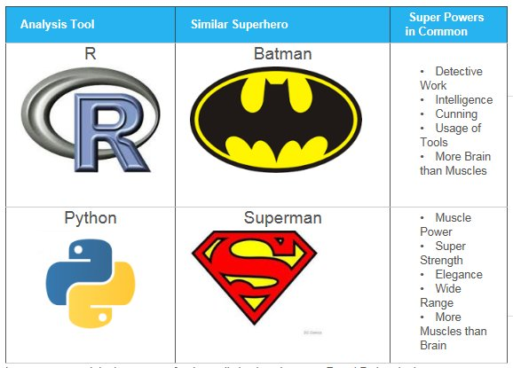

+++
title = "The Real Difference (TM) between Python and R for Data Science"
description = "Smarter than your average comparison"
date = 2019-08-27
[taxonomies]
tags = ["datascience", "rstats", "python", "comparison"]
[extra]
toc = true
+++

## Batman vs Superman

Data science has a two language problem. R and python are **both** _the_ language for data science. This has lead to some pretty abstract, generic and sometimes absurd definitions between the two languages. The worst is probably this image:

Data science is such a wide term, with sometimes a very diverse or even poor understanding in business, that clickbaity titles giving superficial answers abound. I've tracked down the [source of this image](http://ucanalytics.com/blogs/r-vs-python-comparison-and-awsome-books-free-pdfs-to-learn-them/), which has also floated around on twitter [once (2016)](https://twitter.com/lisachwinter/status/715814232676298753) or [twice (2018)](https://twitter.com/cmastication/status/1037486624500854784). To give the author of the post his dues, the article it's derived from is interesting, and I hope the SEO bonus from publishing as the film hype cycle grew got him some extra book sales (the books he links to are actually _really_ worth reading).

I first came across it on (a now removed) instagram post where it was literally captioned \"How to pass any data-science interview\" on an account specifically advertising it's data science recruitment services. I'm not against pop-culture/programming bleed over in any form (I've done enough Pokemon programming talks that any horse I get on has to be less Rapidash and more Ponyta), but at the point that people who are trying to break into the industry are being told this is _valuable information to tell an interviewer_, then there is evidently a gap between needs and knowledge.

The difference, and decision for the 'right' tool for the job is actually defined by a mixture of internal and external factors. Both languages, in themselves, do the job of data ingest, processing, analysis, modelling and prediction equally well. Both can be deployed on-premises or on the cloud. Both  Minor differences in syntax, and major differences in deployment tooling become the defining factors.

## INTERNALS: Syntax and ecosystem

Any programming language is little more than syntax. Functional, Object-oriented, Imperative and more, in various combinations, with specific conventions and patterns. Curiously both [R](https://en.wikipedia.org/wiki/R_(programming_language)) and [Python](https://en.wikipedia.org/wiki/Python_(programming_language)) are 'Multi-paradigm' according to Wikipedia. This means that multiple, different styles can be used depending on the problem at hand. You can write python in an OO way, or a functional way. R is often thought of as functional, though it allows the construction of classes, and objects with methods, and side-effects, so it's not a 'pure functional' language.

### However, how do _people_ actually write code for data science? 

In R, data science is a _first class application_ (and maybe even _sole aplication_?). [Tidyverse](https://www.tidyverse.org/) is arguably the de facto way to write most R projects now. With RStudio giving it full corporate support and funding an eco-system of tooling, most R I write, have seen others write, and I've taught people to write is in this style. Pipes `->` chain function calls with non-standard evaluation of arguments, Rmarkdown documents, ggplot visualisation and shiny apps are an R data scientists solution of choice. Tidyverse is itself _functionally inspired_, [purrr explicitly states this](https://purrr.tidyverse.org/articles/other-langs.html) and [Hadley Wickham directly argues that \"R, at its heart, is a functional programming (FP) language.\"](http://adv-r.had.co.nz/Functional-programming.html)

Python is _everywhere_. Data science in Python isn't pythons only reason for existence. [scipy](https://www.scipy.org/) is the python tool chain for data science. numpy and pandas are best of buddies, and matplotlib is a front runner for graphics. This collection of tools is far less cohesive though, with scikit learn, seaborn and jupyter notebooks also being hugely popular, but totally removed from the scipy ecosystem. These tools therefore need a bit more work to mould into a full product. Object Oriented programming is also more popular, [even for](https://towardsdatascience.com/a-data-scientist-should-know-at-least-this-much-python-oop-d63f37eaac4d) [data science](https://towardsdatascience.com/object-oriented-programming-for-data-scientists-build-your-ml-estimator-7da416751f64). This means you'll be calling objects more directly, and explicitly pulling out methods on objects with `myObject.method` more often.

### What does that mean for me?

Do you understand functional programming or object oriented programming already, or is one immediately making sense over the other? Great, use that one. 
Do you already have an ecosystem of certain tools? Great, use whatever you already have.
Do you already have colleagues that you need to work with? Great, use whatever they are.
Do you already have a support network around you for one language but not the other? Great, don't make life harder than it needs to be.

## EXTERNALS: Application and deployment

What if you don't have an easy answer though? You're starting a new project, or you are the only programmer in the business? Then the choice becomes harder to get right, but more clear the more experience you have. When you know both tools _can achieve_ the same job, you have to choose which one does it _more easily_. I've found that I will reach for python and R equally now I've been working professionally in both for a while, however, _which_ I use is defined pretty clearly.

### When to use R

R encapsulates statistic and mathematical ideas clearly and robustly. Depending on where you get your dependencies from you can have a very clear idea of the likely 'correctness' of the library. Roughly [ROpenSci](https://ropensci.org/) is more rigorous and stable than [CRAN](https://cran.r-project.org/) which is better than github. Tidyverse pipes, NSE, purrr give a tightly coupled working environment where syntax is consistent, terse, and trivially refactored. ggplot and RMarkdown give business consumable outputs from the start, where code can be kept tightly coupled to narrative and reporting, but also infinitely customisable to produce something that would get past marketing without a glance. Many academic publications rely on R and RMarkdown for both research and publication. If you need to make interactive output, shiny is a straightforward application framework, with a tight to everything else in this ecosystem.

R is for **analysts** who need to be _certain_ of the underlying data processing _immediately_, produce and iterate on _reporting_ outputs _as fast as possible_ and write the _least code_ for the most return. [Hadley effectively said as much last week](https://qz.com/1661487/hadley-wickham-on-the-future-of-r-python-and-the-tidyverse/).

> I think R Markdown is an amazing contribution to R. ... When you are doing data analysis typing speed is actually a bottleneck.

### When to use Python

Python is [already used tonnes more than R](https://insights.stackoverflow.com/survey/2019#technology-_-programming-scripting-and-markup-languages) because data science isn't it's _only_ job. Data engineers use it very heavily, back-end and even front-end developers use it for all kinds of projects, wether it is data intensive or not. In many linux distributions (including Mac) it's actually installed as part of your machine when you put the operating system on. It's also arguably a _cloud native_ language. AWS lambda functions [support it out of the box](https://aws.amazon.com/lambda/features/), and Microsoft [recently copied them](https://www.theregister.co.uk/2019/08/20/microsoft_azure_functions/). This is doubly interesting as Microsoft bought one of the [biggest R consultancies in 2015](https://blogs.technet.microsoft.com/machinelearning/2015/04/06/microsoft-closes-acquisition-of-revolution-analytics/), but as of yet R is not a natively supported language in much of Microsofts ecosystem. It's definitely got more baked in R support than AWS ([PowerBI](https://docs.microsoft.com/en-us/power-bi/desktop-r-visuals) and [many others](https://techcommunity.microsoft.com/t5/AI-Customer-Engineering-Team/Understanding-your-R-strategy-options-on-the-Azure-AI-Platform/ba-p/735626?WT.mc_id=Revolutions-blog-davidsmi\u0026WT.mc_id=Revolutions-blog-davidsmi)), but has made moves to [potentially trim back MRAN](https://blog.revolutionanalytics.com/2019/05/cran-snapshots-and-you.html). All this means that Python is spoken by most developers, that python is supported by most big cloud providers, and that python is probably already built into whatever you are working on.

Python is for **developers** who need to _deploy software_ within a _traditional software environment_ in a _more traditional development_ workflow, where _first-class cloud support_ matters, and integration with _existing code_ is of top priority.

## Conclusion

R doesn't [necessarily deploy easily into software development](https://resources.rstudio.com/rstudio-conf-2019/it-depends-a-dialog-about-dependencies) (not strictly related, but great talk that's relevant to the problem), though it is definitely possible (I've done it), you have to put in more work to get a roughly similar result. In many situations, that trade off might not be worth it.

Python doesn't necessarily fit into BI and academic workflows, thought it's definitely possible (I've also done it), you have to put in more work to get a roughly similar result. In many situations, that trade off might not be worth it.

Superman, Batman, Detective Work, Intelligence, Cunning, Usage of Tools, More Brain than Muscles, Muscle Power, Super Strength, Elegance, Wide Range, More Muscles than Brain are not meaningful differentiators.